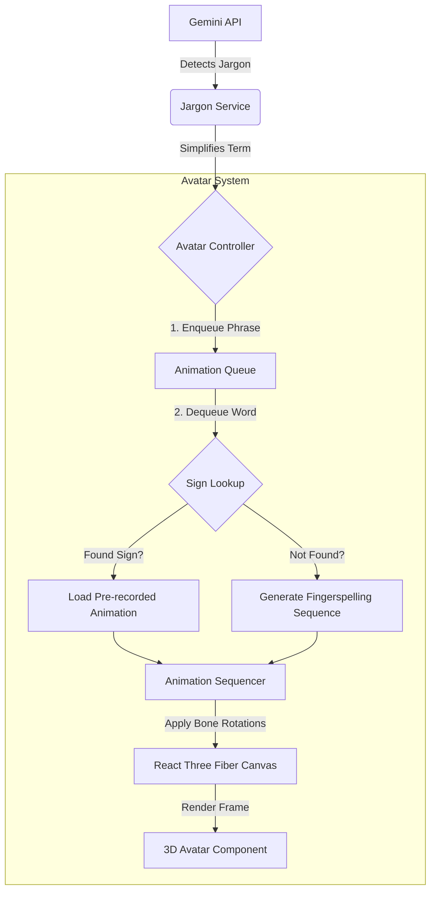

# Text-to-ASL Avatar Architecture

## 1. System Overview

The **Text-to-ASL Avatar** is a subsystem of HealthBridge responsible for visually communicating simplified medical terms to the patient using American Sign Language (ASL). 

**Input**: A simplified English text string (e.g., "High Blood Pressure") derived from the Jargon Detection service.
**Output**: A 3D avatar performing the corresponding ASL signs or fingerspelling the phrase.

## 2. Architecture Diagram

## 3. Core Components

### 3.1 `AvatarCanvas` (Container)
- **Responsibility**: Manages the 3D scene, lighting, camera, and environment.
- **Tech**: `@react-three/fiber`
- **Props**: `width`, `height`, `className`

### 3.2 `AvatarModel` (The Character)
- **Responsibility**: Loads the `.glb` file and exposes the `SkinnedMesh` and `Skeleton`.
- **Tech**: `@react-three/drei` (`useGLTF`, `useAnimations`)
- **Source**: Ready Player Me (standard humanoid rig).

### 3.3 `AnimationController` (The Brain)
- **Responsibility**: Manages the state machine (IDLE -> PREPARING -> SIGNING -> COOLDOWN).
- **Logic**:
    - Listens to the `AnimationQueue`.
    - Interpolates between poses (blending).
    - Handles timing for fingerspelling (e.g., 200ms per letter).

## 4. Animation Strategy

### 4.1 Fingerspelling (Primary Fallback)
Since we cannot have a pre-recorded animation for every possible medical term, we will rely heavily on **Procedural Fingerspelling**.

- **Implementation**: A static dictionary mapping `A-Z` and `0-9` to specific `BoneRotation` objects (Euler angles for fingers).
- **Transition**: Smooth interpolation (slerp) between letter poses.

### 4.2 Sign Dictionary (Medical Terms)
For high-frequency terms (e.g., "Doctor", "Pain", "Yes", "No", "Medicine"), we will use pre-recorded animation clips if available.

- **Storage**: `.json` or separate `.glb` animation files.
- **Mapping**: `{"doctor": "anim_doctor_01", "pain": "anim_pain_02"}`

### 4.3 Data Flow
1.  **Input**: "High Blood Pressure"
2.  **Tokenizer**: `["High", "Blood", "Pressure"]`
3.  **Lookup**:
    - "High" -> *Not found* -> Fingerspell "H-I-G-H"
    - "Blood" -> *Found* -> Play `anim_blood`
    - "Pressure" -> *Not found* -> Fingerspell "P-R-E-S-S-U-R-E"

## 5. Performance Budget

| Component | Target | Note |
| :--- | :--- | :--- |
| **Model Load** | < 1.5s | First load only (cached via `useGLTF`) |
| **Animation Start** | < 100ms | Latency from text input to first movement |
| **Frame Rate** | 60 FPS | Essential for smooth sign language readability |
| **Memory** | < 50MB | Keep texture sizes optimized (1k max) |

## 6. Dependencies

- `three`: Core 3D engine.
- `@react-three/fiber`: React reconciler for Three.js.
- `@react-three/drei`: Useful helpers (OrbitControls, useGLTF, Environment).
- `uuid` (optional): for queue management.

## 7. Future Considerations (Post-Hackathon)
- **Facial Expressions**: Critical for ASL grammar (e.g., raising eyebrows for questions).
- **IK (Inverse Kinematics)**: For more natural arm movements during procedural signing.
